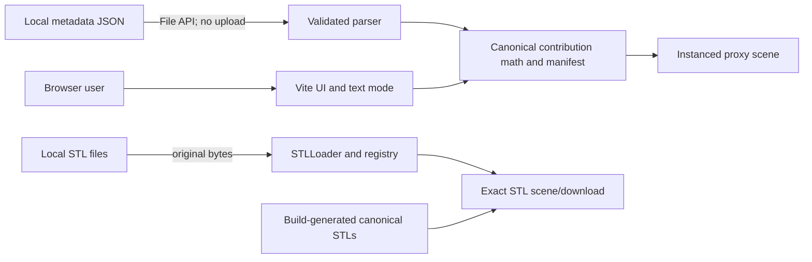
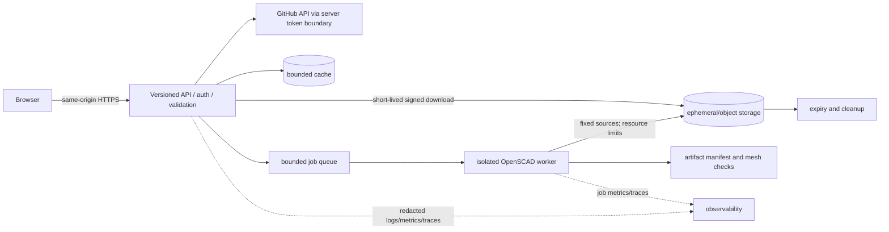

# GitShelves product and engineering design

**Status:** opening MVP design, August 2026. This document complements the canonical [Gridfinity design](gridfinity_design.md) and operational [usage guide](usage.md); those documents remain the detailed CAD and printing references.

## Purpose and users

GitShelves helps GitHub users, gift buyers, makers, and print-service operators turn activity into a legible physical sculpture without hiding the print plan. Jobs to be done are: understand what the sculpture represents; inspect its size, colors, and assembly; obtain exact reproducible parts; and print or hand a complete manifest to a print service.

Primary stories are: (1) as a visitor, I can inspect a sample before sharing data; (2) as a maker, I can import an existing CLI bundle locally and verify every month; (3) as a keyboard, touch, or assistive-technology user, I can get the same print facts without WebGL; and (4) later, as an authenticated GitHub user, I can request a bounded server-side generation job without exposing a token.

## Journey and information architecture

The target journey is **identify GitHub account and range → preview → inspect months, stacks, palette, dimensions, and assembly → approve print plan → generate exact STL artifacts → download a manifest-bound bundle → slice → print → inspect → seat the first modules → stack remaining modules**. This PR begins at preview with a labeled synthetic sample or local files; it contains no username control because no live retrieval exists.

The full-viewport product scene is the primary visual surface. A compact translucent HUD exposes state, assembly mode, camera controls, local imports, color visibility, and downloads. A print-plan panel is the text-equivalent surface. Desktop uses a left control rail and right details panel; narrow/touch layouts become one scrollable column over the scene, with large native controls. Details remain progressively disclosed rather than disguising unavailable features.

The dark spatial environment, orthographic/isometric product framing, editorial type hierarchy, quiet lighting, and restrained motion take qualitative inspiration from the public danielsmith.io experience. **No code, assets, shaders, wording, scene composition, or distinctive interaction is copied.** GitShelves uses its own product geometry, palette, hierarchy, and interaction contract.

## Product geometry: monthly MVP and later daily concept

The MVP deliberately retains twelve months on the existing 2×6 Gridfinity base. It is already represented in Python metadata and OpenSCAD, fits the current reusable-module product vocabulary, limits proxy instances and print quantities, and has an existing CI-rendered baseline. Changing aggregation and carrier geometry simultaneously would obscure physical-validation results.

| Concern | Monthly 2×6 now | Possible daily 53×7 later |
|---|---|---|
| Slots | 12 month columns | 371 calendar cells |
| Carrier | one 252×84 mm nominal grid | must be split into printable carrier tiles |
| Meaning | magnitude of monthly total | GitHub-calendar day fidelity |
| Validation | modeled and CI-rendered baseline | research only |
| Risk | tall stacks, long-base warp | seams, alignment, print time, huge part count |

Daily 53×7 views, modular carrier tiles, and alternate connectors are explicit future design work, not hidden MVP capability.

## Physical system contract

Scene units are millimetres. X increases across six columns, Y across two rows, and Z upward from the base. Slot `i` (January = 0) is `(i mod 6, floor(i/6))` at 42 mm pitch. The nominal grid footprint is 252×84 mm; the repository base source adds bed-oriented border behavior described in the Gridfinity design. A product “cube” is actually the existing 1×1×1U Gridfinity module: 41.5 mm nominal X/Y clearance envelope and a 7 mm height unit, generated with `stackable=true`. The exact shape, lip, and base underside come only from OpenSCAD.

The Gridfinity seating interface links the first module to the base; its existing stackable lip links modules vertically. “Seat” and “stack” do **not** mean snap-fit. Repository documentation records 42 mm pitch, 41.5 mm clearance, and a cited 0.35 mm stack-lip interference guideline, but there is no recorded test-print evidence establishing printer-specific fit. No production approval or physical validation is claimed.

Printable components are one canonical 2×6 base and one canonical reusable module repeated according to the manifest. For contribution count `c`, quantity is zero when `c=0`, otherwise `floor(log10(c))+1`. Each occupied logarithmic level maps to color groups 1–4, with higher legacy levels consolidated to the accent group. Assembly: orient the base; match January–June to row one and July–December to row two; seat one module for each nonzero month; add lower-to-higher levels using the stackable lip; compare against the text manifest; stop if fit, wobble, or damage is concerning.

### Physical validation matrix

| Item | Modeled | CI-rendered | Mesh-checked | Test-printed | Fit-validated |
|---|:---:|:---:|:---:|:---:|:---:|
| Existing 2×6 base source | yes | yes | build checks planned in this PR | no evidence | no evidence |
| Existing reusable module source | yes | newly build-rendered | build script checks finite, nonzero binary STL bounds | no evidence | no evidence |
| Base-to-first-module seating | yes | geometry rendered separately | not a mating simulation | no evidence | no evidence |
| Module stackable lip | yes | geometry rendered | not load tested | no evidence | no evidence |
| Daily carrier/alternate connectors | no | no | no | no | no |

A follow-up calibration program will publish parameterized base/module coupons and a result record containing printer, nozzle, material, drying state, slicer, layer height, orientation, measured dimensions, and photos. Test clearance steps across printer tolerances; PLA/PETG; 0.12/0.20/0.28 mm layers; repeated assembly cycles; insertion/removal force; wear; wobble; lateral shear; stack stability at every supported height; long-base warp; and failure/damage. Repeat across at least two machines before updating claims.

Alternative connectors remain research: keyed stud/socket improves orientation but adds tight tolerance and stress concentration; dovetails resist shear but impose a sliding assembly path; magnets simplify repeated assembly but add cost, polarity, ingestion, and recycling concerns; compliant clips offer retention but create fatigue and print-direction risks. None is print-ready or preferred until coupon results exist.

## Three.js scene contract

The camera is orthographic, placed on an isometric-like diagonal and looking at the assembly center. `fit` computes zoom from viewport and a conservative assembly envelope; reset restores the reviewed product view. Proxy base and module dimensions use millimetres. Assembled transforms place modules at 7 mm vertical increments; exploded transforms add a level-scaled Z gap while preserving month position, making base seating and vertical links visible.

OrbitControls supplies orbit, pan, zoom, reset, and touch gestures. Selection will raycast an instance and announce month/count/level; the opening MVP prioritizes the equivalent labeled month table, with richer visible selection an open question. Color groups are semantic and independently hideable while the base remains visible. Hemisphere fill plus one key light preserve silhouettes without expensive postprocessing. The renderer caps device pixel ratio at 2, resizes, stops scheduling while hidden, honors reduced motion, and uses `InstancedMesh` for modules. The monthly design limit is 12 placements and a documented maximum accepted count; future input validation should cap total instances rather than trusting JSON.

**Design preview** means metadata-driven proxy boxes composed in-browser. They communicate layout and quantities only and are never offered as printable STL. **Exact STL geometry** means bytes produced from canonical Python/OpenSCAD inputs or locally imported and successfully parsed. Generated canonical model bytes are copied into production builds; local imported bytes are retained unchanged for download. An exact STL may still need slicer and physical validation.

## Web metadata and bundle safety

The web-normalized schema is:

```json
{"schemaVersion":"gitshelves.web/v1","designVersion":"monthly-2x6-v1","source":"description","months":[{"month":1,"label":"Jan","contributions":10,"blocks":2,"colorGroup":2}]}
```

The importer accepts current metadata/run-summary roots containing `monthly_contributions` or `months`, including numeric arrays, month records, and month-key maps. It recomputes blocks with the canonical logarithmic rule and requires exactly twelve non-negative integer counts. Missing schema markers are treated as labeled legacy input; malformed JSON, unsupported shapes, empty files, missing months, negative/fractional counts, duplicate filenames, undersized/malformed STL, and STLLoader failures produce inline errors without replacing the last valid plan. Files never leave the browser. Object URLs are short-lived and replaced Three.js resources are disposed. Future schema versions must be explicitly allowlisted, bounded by byte/count limits, and ignore unsafe paths rather than “repairing” them.

The manifest contains schema/design versions, source, deterministic month placements, contributions, heights, total quantity, quantities by color group, referenced base/module filenames, and assembly guidance. It describes the active data; it does not fabricate STL geometry.

## Accessibility

Every action is a native labeled control reachable in document order, with a high-contrast visible focus ring. OrbitControls supports pointer/touch while explicit camera buttons avoid gesture-only operation. Status and errors use a polite live region; mode and selected-month changes should announce. Text mode lists all months, counts, heights, positions, quantities, local files, and exact-download availability. Color is never the only carrier of level information. Foreground/background tokens target WCAG AA contrast. `prefers-reduced-motion` disables damping and decorative transitions. Rendering pauses while hidden. If WebGL fails, canvas is nonessential and the complete text workflow remains useful; production should add an explicit WebGL-error announcement once browser coverage is available.

## Future hosted generator

The browser will call only a versioned same-origin API. GitHub OAuth/App credentials and installation/user tokens terminate server-side and never enter source, builds, Helm values, browser storage, URLs, or logs. A validation and policy layer normalizes username/year, checks authorization, applies per-user/IP rate limits, and reads a bounded cache before enqueueing.

A bounded queue feeds isolated, unprivileged OpenSCAD workers with no shell interpolation or network. Workers receive typed parameters and fixed source revisions, enforce CPU, memory, wall-clock, output-count and artifact-size limits, mesh-check results, and write a hash-bound artifact manifest to ephemeral storage or object storage. The API returns short-lived signed same-origin download links. Lifecycle rules expire artifacts and retries; cleanup is observable and idempotent. Structured logs redact tokens and filenames where needed, metrics cover request/cache/job/worker/artifact/cleanup behavior, and trace IDs join browser-safe request IDs to jobs without secrets.

`GET /healthz` is readiness: 200 only when this stateless web process can serve. `GET /livez` is liveness: 200 while the process event loop responds. Both return short text with `no-store`. A future authenticated or internally scraped `/metrics` exposes Prometheus text without usernames/tokens or high-cardinality job IDs; its presence is not promised by this MVP.





## Threat and abuse analysis

| Threat | Boundary/control |
|---|---|
| Invalid username/year | strict GitHub-name grammar, bounded historical years, canonical normalization before cache keys |
| Token disclosure | server-only secret store; redact headers, query strings, errors, traces, and worker input |
| GitHub quota exhaustion | authenticated conditional requests, cache, user/IP budgets, backoff, global circuit breaker |
| Job concurrency/DoS | admission quota, bounded queue, per-principal concurrency, cancellation and timeout |
| Command injection | no shell; fixed executable/arguments; typed numeric parameters; immutable CAD sources |
| Path traversal | generated opaque IDs, fixed work roots, `openat`-style containment, no client paths |
| Malformed JSON/STL | byte/depth/count limits, schema validation, parser isolation, triangle/bounds/finite checks |
| Artifact amplification | per-file/bundle/tenant quotas and preflight estimates |
| Stale artifacts | TTL policy, idempotent sweeper, deletion metrics and alerts |

## Ownership and release boundaries

GitShelves owns its Dockerfile, GHCR image workflow, Helm chart and workflow, application defaults, model inputs, and release docs. Sugarkube owns environment overlays, deployment, verification, rollback, and observability discovery. Cloudflare owns DNS and Tunnel public-hostname routing. GitShelves does not modify either external system here; planned `staging.gitshelves.com` becomes real only when those owners configure it.

## Decisions, alternatives, risks, questions, and non-goals

Decisions: preserve monthly 2×6 and canonical Python/OpenSCAD; pin npm and Gridfinity inputs; use strict TypeScript without a UI framework; use a small Python standard-library final server; generate rather than commit canonical STLs; keep the chart environment-neutral and require immutable image tags.

Rejected for this PR: CDN scripts (runtime supply-chain/network dependency), runtime OpenSCAD (unsafe and heavyweight), browser GitHub tokens/API calls, fake identity controls, committed generated models, a second Gridfinity implementation, arbitrary URL imports, and a perspective or copied portfolio scene.

Risks/open questions: actual base/module fit is unverified; existing documented tolerances need measured evidence; OpenSCAD build time and cross-platform determinism need CI evidence; imported metadata variants may require fixtures from real CLI runs; exact-scene placement/origin normalization needs broader STL samples; color palette accessibility needs audited contrast; maximum accepted contributions/triangles/bytes needs a product limit; and signed-download/storage providers remain undecided.

Explicit MVP non-goals: OAuth/GitHub App/PAT entry; any runtime third-party API; backend generation; queue/database/PVC/object store; accounts, persistence, billing or sharing; production DNS/Cloudflare/Sugarkube edits; daily 53×7; alternate print-ready connectors; `/metrics`; and claims of test-print, fit, snap, or production approval.
