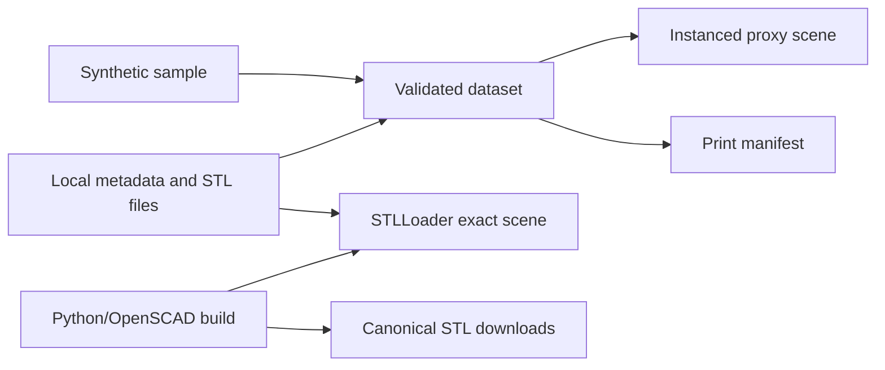
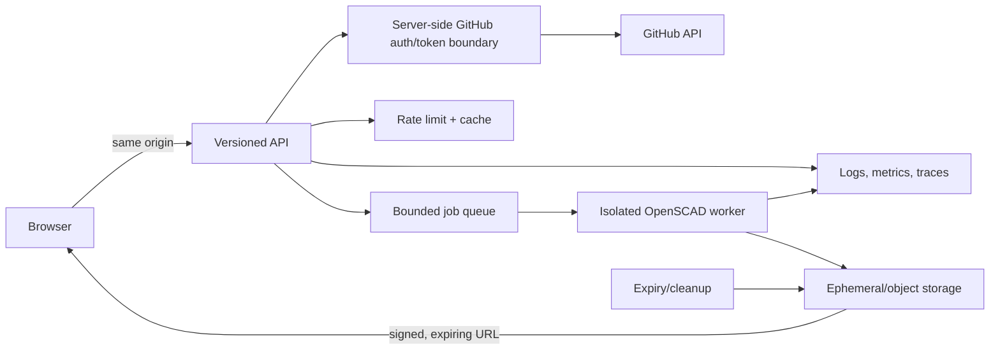

# GitShelves web product and engineering design

## Purpose, users, and jobs

GitShelves lets GitHub contributors, gift buyers, and makers understand an activity dataset as a reusable physical sculpture before committing printer time. Their jobs are to select an identity and range, understand the contribution-to-height transform, plan materials, obtain canonical printable parts, and assemble the result without confusing a browser approximation with a manufacturing file.

Primary stories: as a contributor I can inspect twelve labeled monthly stacks; as a maker I can see quantities, dimensions, colors, and an assembly sequence; as a keyboard or screen-reader user I can use the same controls and text inventory; as a future hosted user I can authenticate without exposing a token to the browser and receive an expiring artifact bundle.

## Journey and information architecture

The target journey is **GitHub identity → time range → metadata preview → print plan → bounded STL job → manifest/download → slicing → test fit → printing → assembly**. This PR begins at metadata preview: it has no identity field and performs no GitHub request. The full-viewport product scene is paired with a compact HUD containing status, view controls, local imports, downloads, file inventory, errors, and a text inventory. On narrow/touch screens the HUD becomes a bottom sheet; orbit uses one finger, pinch zoom, and two-finger/right-drag pan.

Visual direction takes only qualitative cues—an orthographic/isometric spatial experience, dark environment, restrained editorial overlay, subtle light, and strong fallback—from the public danielsmith.io experience. GitShelves does **not** copy its code, assets, shaders, wording, scene composition, or interaction design.

## Product shape: monthly now, daily later

The MVP retains twelve months on the established 2×6 Gridfinity base: it matches current metadata, SCAD, render automation, print-bed assumptions, and a small 12-column inspection surface. It limits complexity while physical fit remains unvalidated. A daily GitHub-calendar sculpture would require 53×7 positions, likely modular carrier tiles, a legibility strategy, more parts, stronger performance bounds, and validated carrier seams. That is future product/design work, not a hidden mode in this release.

## Physical system

Three.js uses a right-handed coordinate system and **millimetres as scene units**: X traverses six columns, Z traverses two rows, and Y is height. Grid pitch is 42 mm, so the nominal grid footprint is 252×84 mm; the existing base source adds a small A1-bed border and uses its current 6 mm extrusion. The reusable contribution module is one 1×1 Gridfinity bin: its nominal cell envelope is 42×42 mm and each existing height unit is 7 mm. “Cube” is product language; the module is not a geometrically perfect cube. Exact dimensions and established source parameters remain in [Gridfinity design](gridfinity_design.md), with slicing guidance in [usage](usage.md).

The first module's existing Gridfinity seating interface locates it on the base; `stackable=true` supplies the existing lip between modules vertically. The repository establishes those modeled interfaces, but contains no recorded clearance measurements, tolerance coupons, test prints, or fit results. Accordingly, this design makes no snap-fit, production approval, or physical validation claim.

Printable components are one reusable base plus one reusable canonical module printed in the manifest quantity. A stack height is 0 for zero contributions, otherwise `floor(log10(count)) + 1`. Up to four displayed color groups map levels 1, 2, 3, and 4+; quantities count every physical module. Assembly: identify the month cell, seat its first module, add remaining modules by the stackable lip, compare against the manifest, and stop if fit or stability is unsafe.

### Physical-validation matrix

| Component/claim | Modeled | CI-rendered | Mesh-checked | Test-printed | Fit-validated |
|---|:---:|:---:|:---:|:---:|:---:|
| 2×6 base source | yes | existing workflow | build plausibility only | no evidence | no evidence |
| 1×1 stackable module | yes | web image build | finite/nonzero STL gate | no evidence | no evidence |
| Base-to-module seating | yes | geometry renders | not an interference proof | no evidence | no evidence |
| Module stack stability | yes | geometry renders | not a load test | no evidence | no evidence |

The next phase creates parameterized clearance coupons, records printer/nozzle/material, dry filament, layer height, wall count, orientation, slicer/version, measured dimensions, insertion/removal force, and photos. Test PLA and PETG across tolerance offsets; repeat at least 50 assembly cycles; measure wobble, lateral shear, retention, wear, and stability at every supported stack height. Record failures, not merely a chosen setting.

Alternative keyed stud/socket connectors may orient well but add overhang and tolerance work; dovetails can resist shear but constrain assembly direction; magnets improve repeated assembly but add cost, ingestion risk, polarity, and recycling concerns; clips can retain yet fatigue or break. None is print-ready here, and all require coupons and destructive/repeated testing before selection.

## Three.js scene contract

The camera is orthographic with a three-quarter isometric pose. `fit` computes frustum width from viewport aspect around the complete 252×84 footprint and stack bounds; reset restores the authored pose. Month `m` uses column `(m-1) mod 6`, row `floor((m-1)/6)`. Assembled modules share 7 mm vertical increments above base seating; exploded mode adds a visible base gap and per-level separation without changing manifest coordinates. Picking/selection is a later enhancement; the DOM list is the authoritative inspection surface now.

Neutral charcoal base material, four green/cyan level colors, hemisphere fill, and one restrained key light communicate parts without claiming slicer colors. Palette visibility never hides the base. Device pixel ratio is capped at 2, repeated modules use `InstancedMesh`, rendering pauses while the document is hidden, resize updates the camera, reduced motion disables damping, and replaced GPU/URL resources are disposed. The monthly limit is tiny (normally fewer than 60 instances); a future daily mode needs an explicit instance/memory budget.

**Design preview** means metadata-driven proxy boxes used only to explain placement and quantities. **Exact STL geometry** means bytes parsed from canonical Python/OpenSCAD build output or explicitly selected local files. Proxy meshes are never offered as printable STL. Python and OpenSCAD remain canonical.

## Metadata and defensive bundle handling

The app consumes either a metadata object or a run summary whose output contains `monthly_contributions`. Each entry requires integer `year`, month 1–12, non-negative integer `count`, and optional `blocks` equal to the canonical transform. The MVP requires twelve unique entries and sorts them chronologically. Unknown fields are ignored; empty/malformed JSON, unsupported shapes, duplicates, inconsistent blocks, malformed STL, duplicate filenames, and implausibly small files produce inline errors while the last good dataset remains active. No selected bytes leave the device. Original STL bytes are retained unchanged for download.

The print manifest is `gitshelves.print-manifest/v1` with design version, placements, counts/heights, total and per-color quantities, referenced base/module filenames, and conservative assembly guidance. It is planning metadata—not a manufacturing certification.

## Accessibility and fallback

All operations use native buttons/labels, visible cyan focus, meaningful labels, keyboard activation, and a polite/error announcement region. The text mode lists every month, count, height, quantities, file/download status, and instructions even if WebGL fails. Contrast targets WCAG AA; color is never the only status cue. Controls remain touch-sized, OrbitControls supports touch, and `prefers-reduced-motion` removes damping/automatic movement. A future selection system must synchronize scene highlighting, focus, and screen-reader announcements.

## Browser-only MVP

## Future hosted generator

The future browser sends validated username/year input to a same-origin, versioned API. GitHub App/OAuth tokens stay server-side and are redacted from logs. Cache keys and per-user/IP rate limits protect API quotas. A bounded queue enforces global and tenant concurrency. An isolated, non-shell OpenSCAD worker accepts typed parameters only, uses fixed source paths, and enforces CPU, memory, wall-time, output-count, and artifact-size quotas. It emits a checksummed artifact manifest to ephemeral or object storage; signed downloads expire and a reaper removes artifacts and abandoned jobs. Structured logs omit tokens and model contents; metrics cover latency, queue depth, failures, quotas, cleanup, and GitHub limits; traces propagate an opaque request ID.

Threat controls: validate GitHub usernames against documented syntax and years against a bounded range; never accept tokens in browser fields/storage/build args; budget GitHub requests; cap job concurrency; invoke OpenSCAD without shell interpolation; resolve paths under fixed roots and reject traversal/symlinks; stream/limit JSON and STL parsing; cap triangles, files, and bytes; scan generated manifests; and make cleanup idempotent with alerts for backlog. Browser content security policy and same-origin downloads prohibit arbitrary remote URL loading.

## Release ownership and service contract

GitShelves owns its Dockerfile, image workflow, Helm chart/workflow, defaults, and release documentation. Sugarkube owns environment overlays, deployment, verification, rollback, and observability discovery. Cloudflare owns DNS and Tunnel public-hostname routing. The static runtime returns 200 text responses from `/healthz` (ready to serve bundled assets) and `/livez` (process alive). A future `/metrics` will use Prometheus text format and must not expose identities, filenames, or tokens.

## Decisions, alternatives, risks, and non-goals

Decisions: preserve monthly 2×6 and canonical math; use Vite/strict TypeScript/Three.js without a UI framework; local-only imports; generated canonical assets at build time; app-owned immutable image/chart coordinates. Rejected now: a second Gridfinity implementation, runtime OpenSCAD, remote URLs, fake identity UI, WebGL-only content, daily layout, and a connector redesign.

Open questions include validated tolerances/materials, maximum safe stack height, exact selection behavior, API schema/auth choice, artifact lifetime, and storage provider. Risks are unvalidated physical fit/stability, browser memory from hostile STL files, OpenSCAD supply-chain/build reproducibility, and ARM builder availability. MVP non-goals are OAuth/GitHub calls, PAT entry, per-request generation, persistence, accounts, billing, production DNS/Cloudflare/Sugarkube changes, daily carriers, and claims of print readiness.
