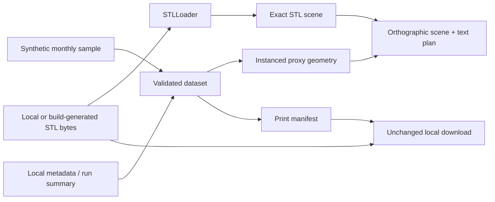
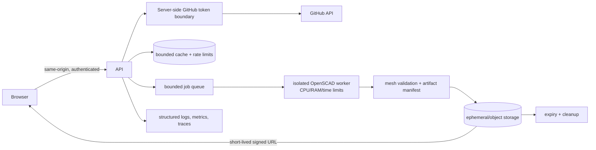

# GitShelves product and engineering design

## Purpose and users

GitShelves turns contribution activity into a legible physical sculpture. It is for GitHub users who want a personal artifact, makers planning a predictable print, and educators or teams explaining activity without a screen. Their jobs are to understand the mapping before spending filament, obtain the exact canonical parts, know quantities and placement, and assemble without guessing.

Primary stories are: **as a visitor**, inspect a representative design without credentials; **as an existing CLI user**, import metadata and STLs locally; **as a maker**, download unchanged printable parts and a manifest; **as a keyboard, touch, low-motion, or non-WebGL user**, receive the same essential information.

## Journey and information architecture

The target journey is GitHub identity and range selection → contribution retrieval → preview → dimensions/color/quantity review → bounded STL job → manifest and signed bundle download → slicing/printing → base-first assembly. This MVP begins at preview with an unmistakably synthetic dataset; it has no username field, authentication, or network retrieval. Existing users can generate data using the [usage guide](usage.md), then load JSON and related STL files. Nothing leaves the browser.

The full-viewport product scene is paired with a compact control HUD and a semantic print-plan table. Desktop keeps the HUD at the upper right; narrow/touch layouts make it full width and move editorial copy below it. Core actions remain ordinary labeled controls in document order rather than canvas-only interactions.

The direction borrows only qualitative traits from danielsmith.io—orthographic spatial presentation, a dusk environment, restrained editorial overlay, gentle light, and robust fallback. It does **not** copy that site's code, assets, shaders, wording, scene layout, or composition.

## Product form: monthly now, daily later

The MVP retains twelve months on the existing 6-column × 2-row base because the Python metadata, OpenSCAD sources, CLI outputs, printable parts, and viewer already agree on that product. It is small enough for an interactive and printable first release and avoids inventing a second contribution transform.

| Design | Benefit | Cost/status |
| --- | --- | --- |
| Monthly 2×6 | Twelve understandable stacks, existing canonical CAD and metadata | MVP; coarse time resolution |
| Daily 53×7 | Familiar GitHub-calendar detail | Future: 371 cells, large footprint, heavier rendering/printing, carrier segmentation and labeling decisions |

A daily view, modular carrier tiles, and alternate connectors remain explicit research work, not implied compatibility.

## Physical system

See the canonical [Gridfinity design](gridfinity_design.md) and operational [printing guidance](usage.md); those documents own detailed CAD/slicer instructions. Scene units are millimetres: +X runs through six columns, +Y through two rows, and +Z rises from the base. Cell origins are deterministic at `(column × 42, row × 42)`.

- The nominal pitch is 42 mm. The current base occupies 6×2 cells (252×84 mm grid, with its source-defined border reaching 256 mm in X). Its existing modeled base height is 6 mm.
- A product-language “cube” is the existing 1×1×1U Gridfinity contribution module: nominal 42 mm pitch, modeled 41.5 mm bin clearance, and 7 mm unit height; it is not a geometrically perfect cube.
- The first module seats in the Gridfinity base interface. Further modules use the existing `stackable=true` lip vertically. Neither is described as snap-fit or production-approved.
- Established repository values are the 42 mm pitch, 41.5 mm module clearance convention, 7 mm height unit, source-defined base seating, and library-defined lip. No additional tolerance is invented here.
- Printable reusable components are one canonical 2×6 base and one canonical module repeated according to the manifest. Color groups correspond to logarithmic levels, capped to the existing four rendered groups for the web palette.
- Assembly: orient the labeled base; match month to its row/column; test-seat the first module; add each higher level on its lip; inspect alignment/stability after every stack; stop if fit is unsafe.

Contribution height remains `0 → 0`, otherwise `floor(log10(count)) + 1`. Total quantity is the sum of monthly heights; group quantity counts every occupied level, with level 4 and above using the accent group.

### Physical validation matrix

| Component/interface | Modeled | CI-rendered | Mesh-checked | Test-printed | Fit-validated |
| --- | --- | --- | --- | --- | --- |
| 2×6 base | Yes | Existing workflow | Automated nonzero-triangle and finite, nonzero-bounds validation | No evidence recorded | No evidence recorded |
| 1U module | Yes | Build-generated for web | Automated nonzero-triangle and finite, nonzero-bounds validation | No evidence recorded | No evidence recorded |
| base ↔ first module | Yes | Geometry renders | Visual/mesh only | No evidence recorded | **No** |
| module ↔ module lip | Yes | Geometry renders | Visual/mesh only | No evidence recorded | **No** |

“Modeled” and “rendered” are not evidence of printability or fit. A follow-up will print calibration coupons across printer profiles, PLA/PLA+/PETG, nozzle and layer heights; measure clearance; cycle assembly repeatedly; record wear, wobble and shear; test 1–4+ module stack stability; photograph results; and only then select tolerances. Results must include printer/material/layer height, measured dimensions, cycle count, failure mode, and pass criterion.

Connector alternatives remain research: keyed stud/socket improves orientation but adds tolerance/overhang work; dovetails resist shear but constrain assembly direction; magnets ease repeated assembly but add cost, polarity, ingestion, and recycling risks; clips are inexpensive but fatigue and can demand supports. None is print-ready or superior without coupons and test data.

## Browser MVP architecture

### Scene contract

The orthographic camera begins at an isometric three-quarter angle. Fit computes the active content bounding sphere and adjusts the orthographic frustum; resize preserves vertical scale and aspect. Month `m` maps to `column=(m-1)%6`, `row=floor((m-1)/6)`. Assembled Z is base height plus `level×7`; exploded mode adds a visible base gap and 10 mm between modules. OrbitControls provides orbit, pan, and zoom; reset and fit are explicit.

Selection is represented by the month table in this opening MVP; raycast highlighting is deferred. Four high-contrast green/cyan levels and a neutral base avoid relying on color alone. Hemisphere and directional lights provide restrained depth. Proxy modules use one `InstancedMesh`; the target budget is 12 months and fewer than 100 instances, with a hard future review before accepting larger layouts. Device pixel ratio is capped at 2, hidden tabs stop frames, resize updates projection, and replaced geometry/materials are disposed. Reduced motion disables control damping.

### Proxy versus exact geometry

Metadata-driven boxes are a **Design preview** for layout, stack height, and color planning. They are never downloadable or called printable. **Exact STL geometry** is parsed from bytes produced by canonical Python/OpenSCAD sources or selected locally. Those original bytes—not re-exported Three.js geometry—power downloads. Python and OpenSCAD remain the authority.

### Input schema and failure safety

The native browser shape is `gitshelves.web/v1`: integer `year` plus exactly 12 month objects containing non-negative integer `contributions`. The importer also accepts current metadata/run-summary monthly maps and recomputes heights with the same logarithmic rule. The manifest uses `gitshelves.print-manifest/v1`, design `monthly-2x6-v1`, month placements, counts/heights, total/group quantities, referenced files, and assembly guidance.

Empty/malformed JSON, unsupported objects, negative/non-integer counts, missing months in the native schema, duplicate filenames, non-STL extensions, tiny/malformed meshes, and parse failures produce inline errors and do not replace the last valid dataset. Files are read locally, remote URLs are rejected by omission, original bytes are retained, and object URLs are promptly revoked. Partial STL bundles remain listed but cannot claim a complete canonical download set.

## Accessibility

All modes/actions are keyboard-focusable with visible focus rings and `aria-pressed` mode state. The scene has a screen-reader label; file results and errors use a polite live region. Text and controls meet a high-contrast charcoal/mint palette, while quantities and labels avoid color-only meaning. OrbitControls supports pointer/touch, controls have touch-size spacing, and horizontal tables scroll. `prefers-reduced-motion` removes damping and transitions. The print-plan table remains useful when WebGL is absent or disabled and lists every month, contributions, height, base cell, total quantity, and exact-download status.

## Future hosted generator

The browser talks only to a versioned same-origin API. GitHub App/OAuth credentials and installation tokens stay server-side, scoped and redacted. Validated cached contribution responses reduce API quota use; per-identity/IP limits and bounded concurrency protect GitHub and the workers. Jobs use fixed templates and typed parameters—not shell interpolation—inside a networkless, read-only worker with CPU, memory, wall-time, process and artifact-size limits. Random server-owned IDs prevent path traversal. JSON and STL parsers are size/depth/finite-bounds constrained. A manifest records hashes, byte sizes, design/source versions and expiry. Temporary/object storage uses short-lived signed downloads and deterministic cleanup/reconciliation.

Threat controls include strict GitHub-login/year allowlists; secret scanning and redaction; upstream quota/backoff; per-tenant concurrency; argument-vector execution; canonicalized job directories; malformed JSON/STL rejection; compressed/uncompressed quotas; expiry, deletion retries and orphan metrics. Logs exclude tokens and contribution payloads by default; metrics cover request/job latency, queue depth, rejects and cleanup; traces use opaque request/job IDs.

`GET /healthz` means the HTTP process can serve; `GET /livez` means the process event loop is alive. Both return 200 plain text without dependency or secret detail. A future authenticated/internal `GET /metrics` exposes Prometheus text and is absent in this MVP. Readiness will later include only dependencies required to accept safe work; liveness must not flap on GitHub/storage outages.

## Ownership and release boundary

GitShelves owns its Dockerfile, image workflow, Helm chart/workflow, defaults and release docs. Sugarkube owns environment overlays, deployment, verification, rollback and observability discovery. Cloudflare owns DNS and Tunnel public-hostname routing. The planned `staging.gitshelves.com` value therefore does not appear as a chart default.

## Decisions, alternatives, risks, and questions

Decisions: preserve monthly 2×6 and canonical CAD; local-only inputs; static immutable runtime; orthographic proxy fallback; unchanged STL bytes; separate image tag and chart version. Rejected for this PR: CDN scripts, a second Gridfinity implementation, runtime/per-request OpenSCAD, arbitrary URLs, browser tokens, a fake identity UI, daily layout, and unvalidated connectors.

Explicit non-goals are OAuth/GitHub App work, API calls, PAT entry, accounts, billing, persistence, queue/storage, production DNS/Tunnel, and physical-fit claims. Risks are WebGL/driver variance, large/malicious local meshes, upstream CAD reproducibility, untested physical fit, and accessibility gaps in spatial inspection. Open questions include validated clearance by printer/material, safe job/artifact ceilings, palette semantics, daily carrier topology, retention, authentication model, and whether future selection should synchronize raycasting and table focus.
