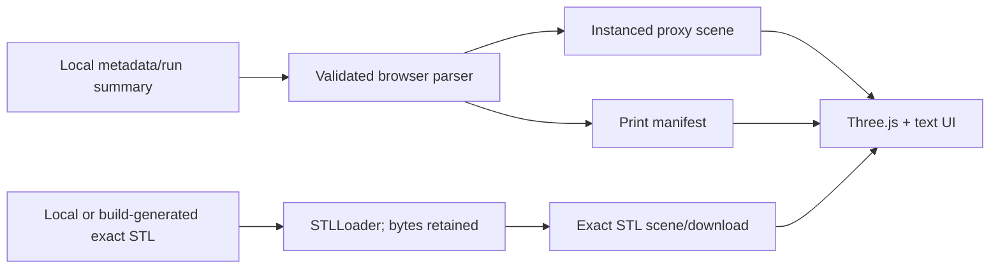
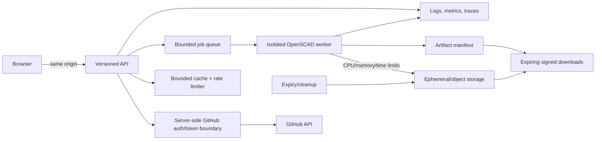

# GitShelves product and engineering design

## Purpose and people

GitShelves makes GitHub activity tangible: reusable printed contribution “cubes” form monthly columns on a reusable base. It serves makers who want a personal artifact, gift buyers who need a legible print plan, and maintainers who need deterministic files. Their jobs are to preview before spending material, understand quantity/color/assembly, and obtain geometry with traceable provenance. Primary stories are: “As a maker, I can inspect every month and download exact canonical parts”; “As a keyboard or screen-reader user, I can get the same facts in text”; and, later, “As a GitHub user, I can authorize retrieval without exposing a token.”

## Target journey and information architecture

The target journey is identity and time range → contribution retrieval → interactive preview → dimensions/color/quantity inspection → bounded STL job → artifact manifest/download → slice/print → seat first modules → stack remaining modules. This PR starts at local metadata: **Preview** is the full-viewport model, **Plan** is the text/manifest view, and **Files** is local import/download. No fake identity field appears.

Desktop keeps a compact control HUD over the scene and print plan at the lower edge. Small screens prioritize a touch-sized control sheet and leave orbit/pinch available. The monthly product is retained because the Python metadata, 2×6 base, canonical SCAD, generated files, and assembly semantics already agree; it is the smallest honest, printable contract. See [usage](usage.md) and the [Gridfinity design](gridfinity_design.md).

## Visual direction

The direction takes only qualitative cues from danielsmith.io: an orthographic/isometric spatial presentation, dark atmosphere, careful typography, restrained overlays, subtle light, and calm motion. GitShelves uses its own scene, palette, wording, geometry, layout, code, assets, and shaders; it does **not** copy that site.

## Monthly MVP versus daily future

| Property | Monthly 2×6 MVP | Possible daily 53×7 |
|---|---|---|
| Cells | 12 | 371 calendar positions |
| Existing contract | Canonical and documented | Research only |
| Carrier | One 2×6 Gridfinity base | Likely modular carrier tiles |
| Interaction/print cost | Bounded and understandable | Much larger scene, print, labeling, and packaging problem |
| Decision | Ship first | Validate demand and connector/carrier design later |

Daily calendar views, modular carriers, and alternate connectors are future product/design work, not print-ready promises.

## Physical system

Scene units are millimetres: +X moves across six columns, +Y moves to the second row, and +Z rises from the print bed. Grid cells use the established **42 mm pitch**. The 2×6 footprint is nominally 252×84 mm; actual edge/body geometry comes from `baseplate_2x6.scad`. A product “cube” is the existing Gridfinity 1×1, one-height-unit module: a 42 mm grid footprint with **7 mm height unit**, generated with `stackable=true`; rounded walls, lips, and effective exterior dimensions must be measured from the exact STL rather than inferred from the word cube.

The established interface is Gridfinity base seating from base to first module and the existing stackable lip between modules. Repository sources specify 1.2 mm walls and 1.6 mm floor, with no magnet pockets. No repository evidence establishes printer clearance, snap-fit behavior, production approval, or physical fit. Python/OpenSCAD remain canonical.

Printable components are one reusable base plus one reusable canonical module printed `sum(stack heights)` times. A level uses its configured color group; the manifest reports totals. Assembly: orient base; match month to its deterministic 6×2 cell; seat the first module; add modules vertically in level/color order; visually inspect stability before handling.

### Validation matrix

| Component/claim | Modeled | CI-rendered | Mesh-checked | Test-printed | Fit-validated |
|---|:---:|:---:|:---:|:---:|:---:|
| Existing 2×6 base | ✓ | ✓ | limited automated bounds in this PR | not recorded | not recorded |
| Existing stackable module | ✓ | build-rendered in this PR | limited automated bounds in this PR | not recorded | not recorded |
| Base seating | ✓ | geometry only | geometry only | not recorded | not recorded |
| Vertical stack stability | ✓ | geometry only | geometry only | not recorded | not recorded |

“Modeled” and “rendered” are not physical validation. A follow-up calibration coupon should vary XY/Z compensation and mating clearance; record printer/nozzle, material, layer height, orientation, slicer, measured dimensions, insertion/removal force, repeated assembly cycles, wear, wobble, lateral shear, and stability at each supported stack height. Test PLA and PETG separately and publish photos/results before any fit claim.

Alternatives remain exploratory: keyed stud/socket gives orientation but needs tolerance validation; dovetails constrain shear but may bind and impose print direction; magnets ease assembly but add cost, polarity, ingestion, and recycling concerns; clips are replaceable but fatigue and create small parts. None is selected or print-ready.

## Browser scene contract

An orthographic camera starts in an isometric product pose. Fitting computes a world bounding box, centers controls, and updates frustum bounds on resize. Month `m` maps deterministically to `(m-1)%6, floor((m-1)/6)` at 42 mm pitch. Assembled Z is base seating plus 7 mm per level; exploded mode adds bounded month/level separation while preserving association. OrbitControls provides orbit, pan, zoom; reset and fit are explicit.

Selection is represented by text rows and file list in this draft; future ray selection must synchronize focus and announcements. Four restrained, contrast-separated green/cyan/blue/violet groups can be independently hidden without hiding the base. Hemisphere and directional lights avoid expensive effects. Repeated modules use `InstancedMesh`; pixel ratio is capped at 2, resize is responsive, hidden tabs pause animation, reduced-motion disables damping, and replaced resources/object URLs are disposed. This 12-cell design stays comfortably below 100 module instances; a daily design requires separate profiling and budgets.

**Design preview** is metadata-driven proxy geometry for inspection only. **Exact STL geometry** is parsed from unchanged STL bytes produced by canonical Python/OpenSCAD or selected locally. Proxy boxes are never offered as printable STL. Default production builds generate and serve the exact canonical base and reusable module; unprepared development falls back with disabled downloads and preparation guidance.

## Browser metadata and safe bundles

The app accepts UTF-8 GitShelves per-output metadata or run-summary JSON containing exactly twelve ordered monthly non-negative integer counts (arrays or date-keyed maps). It computes the same `0 → 0`, otherwise `floor(log10(count))+1` rule, validates before replacing state, and identifies whether the input is metadata or a run summary. The print manifest uses schema `1.0`, design `monthly-2x6-v1`, placements, contributions, heights, total quantity, quantities by level/color, referenced exact files, and cautious assembly guidance.

Empty/malformed JSON, unsupported shapes, invalid counts, duplicate filenames, and malformed STL produce inline errors and retain a safe prior view. Arbitrary URLs are never loaded. Local STL bytes remain in-browser and are copied byte-for-byte for download. Inputs should later gain explicit byte/triangle caps before accepting untrusted large bundles.

## Accessibility

All controls are native keyboard controls with visible cyan focus, programmatic labels, pressed states, and a live status/error announcement. The text mode lists every month, count, height, cell, quantity, file status, and download availability independently of WebGL. Orbit/pan/zoom work with pointer, wheel, and touch; reset/fit offer keyboard equivalents. Colors are supplemental to labels, foreground/background contrast is targeted at WCAG AA, and `prefers-reduced-motion` removes nonessential damping/motion. `<noscript>` and WebGL failure guidance point to the CLI/text contract. Browser smoke tests protect initial sample and controls.

## Architectures

The future same-origin API validates GitHub usernames against documented syntax and years/ranges against bounded policy. GitHub tokens remain server-side, redacted from errors/logs, scoped minimally, rotated, and never enter builds/browser storage. Per-principal/IP quotas, cache coalescing, GitHub-rate-limit response handling, bounded queue depth/concurrency, and cancellation prevent amplification.

Workers receive typed job data rather than shell fragments, run OpenSCAD without a shell in isolated non-root sandboxes with network off and CPU/memory/wall-clock limits, and use server-selected templates. Canonicalized job/artifact IDs prevent command injection and path traversal. JSON/STL parsing gets byte, nesting, triangle, file-count, and output-size quotas. Artifacts use unpredictable identifiers, integrity hashes, explicit MIME/filenames, signed short-lived downloads, lifecycle expiry, and idempotent cleanup. Structured logs omit tokens and user content where possible; metrics cover latency, quota rejection, queue depth, failures and cleanup; traces propagate opaque IDs.

GitShelves owns Dockerfile, image workflow, Helm chart/workflow, defaults, and release docs. Sugarkube owns environment overlays, deployment, verification, rollback, and observability discovery. Cloudflare owns DNS and Tunnel public-hostname routing. `/healthz` reports ability to serve required static assets, `/livez` reports process/event-loop life, both return cache-disabled 200 text in this static MVP, and future `/metrics` is an internal Prometheus endpoint without user/token labels.

## Decisions, non-goals, risks, questions

Decisions: monthly first; one canonical reusable module; local-only imports; no CDN; static Python stdlib runtime; immutable release coordinates; environment-neutral chart. Rejected now: a second contribution algorithm, runtime OpenSCAD, remote URL loading, client GitHub access, committed generated STL, and daily carrier design.

Explicit MVP non-goals are OAuth/GitHub App/PAT UI, live GitHub calls, accounts, billing, database, queues, per-request generation, storage, Cloudflare/DNS, and production fit claims. Risks are lack of physical tests, browser memory from hostile STL, OpenSCAD/Gridfinity reproducibility across architectures, orthographic accessibility discoverability, and metadata variants not represented by fixtures. Open questions: acceptable input limits; exact effective module envelope; target printers/materials; maximum stable height; whether level or month should govern palette; authentication model; retention period; and daily carrier segmentation.
